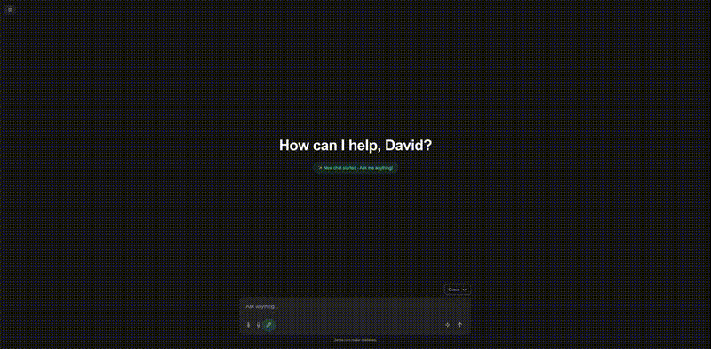
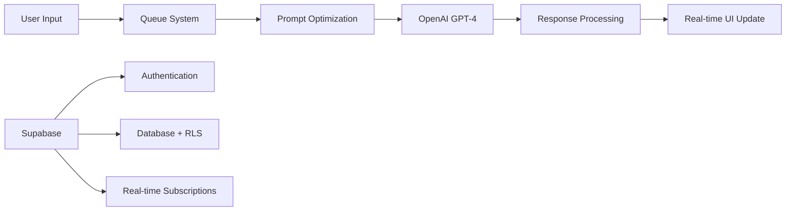

# 🚀 Queue Chat

> **Asynchronous AI chat with intelligent message queuing and two-stage prompt optimization**

[](https://nextjs.org/)
[](https://www.typescriptlang.org/)
[](https://supabase.com/)
[](https://openai.com/)



**[📹 Live Demo](./public/demo.mp4)** • **[🔗 Try it Live](#)** • **[📖 Documentation](#)**

---

## ✨ Features

🔄 **Asynchronous Message Queue** - Batch multiple queries for enhanced context
🧠 **Two-Stage AI Processing** - Input optimization → Enhanced responses
📊 **AI-Powered Diagrams** - Automatic Mermaid.js generation
🔐 **Multi-User Security** - Row-level security with OAuth authentication
📱 **Responsive Design** - Optimized for desktop and mobile
⚡ **Real-time Updates** - Live queue status and conversation sync

## 🏗️ Architecture



## 🚀 Quick Start

```bash
# Clone & install
git clone https://github.com/yourusername/queue-chat.git
cd queue-chat && npm install

# Setup environment
cp .env.example .env.local
# Add your OPENAI_API_KEY and Supabase credentials

# Initialize database
# Run scripts/init_database.sql in your Supabase dashboard

# Start development
npm run dev
```

**🌐 Open [localhost:3000](http://localhost:3000)**

## 🛠️ Tech Stack

| Category | Technology |
|----------|------------|
| **Frontend** | Next.js 15, React 19, TypeScript, Tailwind CSS |
| **Backend** | Next.js API Routes, Supabase PostgreSQL |
| **AI/ML** | OpenAI GPT-4, Custom prompt optimization |
| **Auth** | Supabase Auth (Google OAuth, GitHub) |
| **Database** | PostgreSQL with Row Level Security |
| **Deployment** | Vercel, Supabase Cloud |

## 📁 Project Structure

```
src/
├── app/                 # Next.js App Router
│   ├── api/            # API endpoints
│   └── auth/           # Authentication flows
├── components/         # React components
│   ├── chat/          # Chat interface
│   ├── queue/         # Message queue UI
│   └── ui/            # Reusable components
├── hooks/             # Custom React hooks
├── lib/               # Utilities & configurations
├── types/             # TypeScript definitions
└── integrations/      # External service integrations
```

## 🔧 Environment Variables

```bash
# Required
OPENAI_API_KEY=sk-...
NEXT_PUBLIC_SUPABASE_URL=https://your-project.supabase.co
NEXT_PUBLIC_SUPABASE_ANON_KEY=eyJ...
SUPABASE_SERVICE_ROLE_KEY=eyJ...

# Optional
NEXT_PUBLIC_APP_URL=http://localhost:3000
```

## 🤝 Contributing

1. Fork the repository
2. Create your feature branch (`git checkout -b feature/amazing-feature`)
3. Commit your changes (`git commit -m 'Add amazing feature'`)
4. Push to the branch (`git push origin feature/amazing-feature`)
5. Open a Pull Request

## 📄 License

This project is licensed under the MIT License - see the [LICENSE](LICENSE) file for details.

---

<div align="center">
  <strong>Built with ❤️ using Next.js and OpenAI</strong>
</div>