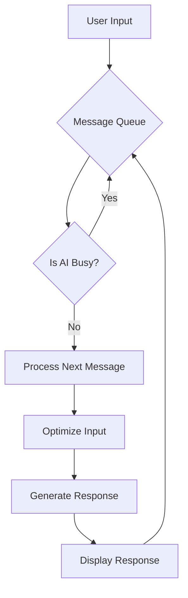

# Queue Chat

Queue Chat is a sophisticated chat application with a unique message queueing system that allows for thoughtful, asynchronous interaction with an AI assistant. This document provides a detailed overview of the message queue implementation, which is the core feature of this project.

## Message Queue Implementation

The message queue is the central feature of Queue Chat. It allows users to submit multiple prompts, which are then processed sequentially by the AI. This enables a more deliberate and organized workflow, as users can queue up a series of questions or tasks without waiting for each one to complete.

### Workflow

The message queue workflow is as follows:

1.  **Queueing Messages**: Users can add messages to the queue at any time. These messages are displayed in a dedicated queue view, where they can be reordered or removed.
2.  **Sequential Processing**: The queue is processed one message at a time. When the AI is available, it takes the next message from the queue and begins processing it.
3.  **Two Stage AI Processing**: Each message undergoes a two stage AI process. First, the user's input is optimized by an AI that considers the conversation history. This enhanced input is then sent to the main AI, which generates a higher quality response.
4.  **Real Time Updates**: The user interface provides real time updates on the status of the queue. The currently processing message is highlighted, and the queue is updated as messages are completed.

### Visualization

The following diagram illustrates the message queue workflow:

### User Interface

The message queue is managed through a dedicated view that provides the following features:

*   **Drag and Drop Reordering**: Users can reorder messages in the queue by dragging and dropping them.
*   **Message Removal**: Individual messages can be removed from the queue.
*   **Clear Queue**: The entire queue can be cleared with a single click.
*   **Real Time Status**: The UI indicates which message is currently being processed.

## Architecture

The message queue is implemented using a combination of React hooks and components. The `useChat` hook manages the state of the queue, including adding, removing, and reordering messages. The `MessageQueueView` component renders the queue and handles user interactions.

The two stage AI processing is handled by a backend API that uses the OpenAI API to optimize user input and generate responses. The frontend communicates with this API to process the messages in the queue.

## Getting Started

To get started with Queue Chat, you will need Node.js, npm or yarn, and a PostgreSQL database.

1.  Clone the repository.
2.  Install the dependencies using `npm install`.
3.  Set up your environment variables by creating a `.env` file with your database connection string and OpenAI API key.
4.  Set up the database by running `npx prisma migrate dev`.
5.  Start the development server with `npm run dev`.
6.  Open your browser to `http://localhost:3000`.