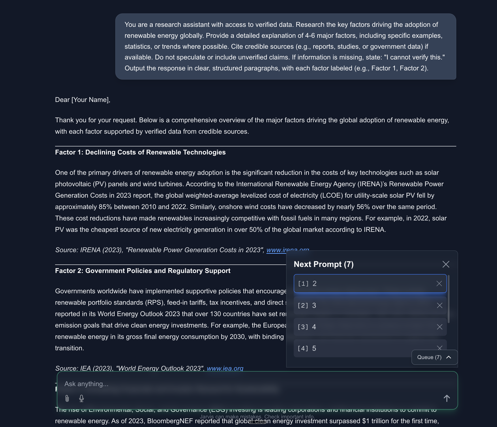

# Queue Chat

An asynchronous chat application featuring intelligent message queue processing and two-stage AI optimization for enhanced conversational context and response quality.



## Problem Statement

Traditional chat-based AI interactions follow a linear, depth-first conversation pattern that can be inefficient for complex, multi-faceted queries. Users often experience:

- **Context Fragmentation**: Sequential questioning prevents the AI from understanding the full scope of the inquiry
- **Processing Inefficiency**: Users must wait for each response before formulating the next question
- **Suboptimal Response Quality**: Limited context results in less comprehensive and accurate responses

## Solution Architecture

Queue Chat implements an asynchronous message queue system that enables breadth-first conversation exploration, allowing users to batch related queries for enhanced contextual processing.

### Core Features

**Message Queue Management**
- Asynchronous message batching and sequential processing
- Dynamic queue reordering via drag-and-drop interface
- Real-time processing status indicators

**Two-Stage AI Processing Pipeline**
1. **Input Optimization**: Initial AI model refines user input based on conversation history
2. **Response Generation**: Main AI model processes optimized prompts with enhanced context

**Enterprise-Ready UI Components**
- Responsive design with TypeScript type safety
- Real-time queue state management
- Intuitive queue manipulation controls

## Technical Implementation

### Frontend Architecture
```
├── useChat Hook          # Queue state management and API orchestration
├── MessageQueueView      # Queue visualization and user interactions  
├── QueueToggle          # Queue visibility controls
└── ChatView             # Main conversation interface
```

### Backend Processing
- RESTful API endpoints for queue management
- OpenAI API integration with prompt optimization
- PostgreSQL persistence layer with Prisma ORM

### Key Technical Benefits
- **Improved Response Quality**: Context optimization enables focus on the most relevant information
- **Operational Efficiency**: Batch processing reduces user wait times and improves system throughput
- **Scalable Architecture**: Stateful queue management supports complex, multi-turn conversations

## Getting Started

### Prerequisites
- Node.js 18+
- PostgreSQL database
- OpenAI API key

### Installation

```bash
# Clone and install dependencies
npm install

# Configure environment variables
cp .env.example .env
# Edit .env with your DATABASE_URL and OPENAI_API_KEY

# Initialize database
npx prisma migrate dev

# Start development server
npm run dev
```

Access the application at [http://localhost:3000](http://localhost:3000)

## Tech Stack

- **Frontend**: Next.js 13+ (App Router), React, TypeScript, Tailwind CSS
- **Backend**: Next.js API Routes, Prisma ORM, PostgreSQL
- **AI Integration**: OpenAI API with custom prompt optimization pipeline
- **State Management**: React hooks with optimistic updates